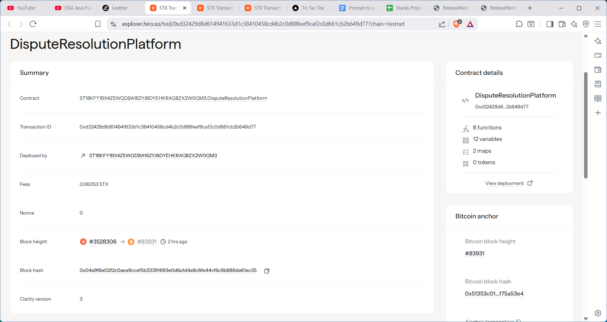

# DisputeResolution Platform

## Project Description

The DisputeResolution Platform is a decentralized arbitration service built on the Stacks blockchain using Clarity smart contracts. This platform enables parties to resolve disputes through expert mediators in a transparent, fair, and enforceable manner. The system allows users to file disputes, select qualified mediators, and receive binding decisions that are automatically enforced through smart contract logic.

Key features include:
- **Decentralized Dispute Filing**: Users can create disputes by depositing STX and providing case details
- **Expert Mediator Network**: Qualified mediators with reputation scores handle dispute resolution
- **Automated Enforcement**: Smart contract automatically executes decisions and distributes funds
- **Reputation System**: Mediators build reputation through successful case resolutions
- **Transparent Process**: All dispute details and decisions are recorded on-chain

## Project Vision

Our vision is to create a trustless, efficient, and accessible dispute resolution mechanism that eliminates the need for traditional legal systems for many types of conflicts. By leveraging blockchain technology, we aim to:

1. **Democratize Justice**: Provide affordable and accessible dispute resolution for all users regardless of geographical location or economic status
2. **Ensure Transparency**: Create a fully transparent system where all processes and decisions are publicly verifiable on the blockchain
3. **Build Trust Through Reputation**: Establish a merit-based system where mediators earn reputation through fair and effective dispute resolution
4. **Enable Global Commerce**: Facilitate secure transactions and business relationships across borders with reliable dispute resolution mechanisms
5. **Reduce Costs**: Significantly lower the cost of dispute resolution compared to traditional legal systems

## Future Scope

The DisputeResolution Platform has extensive potential for growth and enhancement:

### Short-term Enhancements (6-12 months)
- **Multi-Mediator Panels**: Allow complex disputes to be resolved by panels of multiple mediators
- **Evidence Submission System**: Enable parties to submit digital evidence and documents
- **Time-bound Resolutions**: Implement automatic escalation for disputes not resolved within specified timeframes
- **Appeal Mechanism**: Create a structured appeal process for disputed decisions

### Medium-term Developments (1-2 years)
- **AI-Assisted Mediation**: Integrate AI tools to help mediators analyze cases and suggest resolutions
- **Specialized Dispute Categories**: Create specialized tracks for different types of disputes (commercial, employment, intellectual property, etc.)
- **Integration with DeFi Protocols**: Connect with DeFi platforms to handle financial disputes automatically
- **Cross-chain Compatibility**: Expand to support disputes involving assets on multiple blockchains

### Long-term Vision (2-5 years)
- **Legal Framework Integration**: Work with jurisdictions to provide legally binding arbitration
- **Corporate Dispute Resolution**: Scale to handle large-scale corporate and institutional disputes
- **Insurance Integration**: Partner with insurance providers to offer dispute resolution coverage
- **Global Mediator Network**: Build a worldwide network of certified mediators with diverse expertise
- **Smart Contract Templates**: Provide pre-built dispute resolution clauses for common contract types

### Technical Roadmap
- **Mobile Application**: Develop user-friendly mobile apps for iOS and Android
- **Advanced Analytics**: Implement comprehensive analytics and reporting for dispute trends
- **API Integration**: Provide APIs for third-party platforms to integrate dispute resolution services
- **Privacy Enhancements**: Implement zero-knowledge proofs for confidential dispute handling

## Contract Address Details

**Contract Address**: ST18KFY1BX4Z5WQDBA162YJ6DYEHKRAQ8ZX2W0QM3.DisputeResolutionPlatform

**Network**: Stacks Mainnet

**Contract Name**: dispute-resolution-platform

**Key Functions**:
- `create-dispute`: File a new dispute with deposit
- `resolve-dispute`: Mediator resolves dispute and enforces decision

**Read-only Functions**:
- `get-dispute`: Retrieve dispute information
- `get-mediator`: Get mediator details and reputation
- `get-dispute-count`: Get total number of disputes
- `get-min-deposit`: Get minimum deposit requirement

**Admin Functions**:
- `register-mediator`: Register new mediators (owner only)
- `set-min-deposit`: Update minimum deposit amount (owner only)

---
